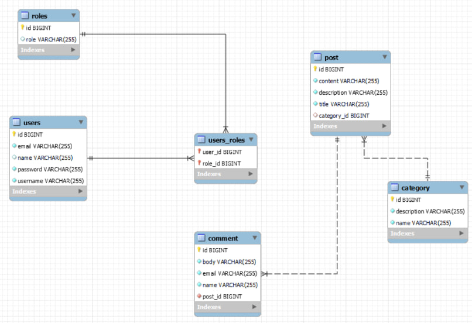

# Blog App
Create a backend system using spring boot and spring security based on RESTful architecture, the application has the function of managing user POSTs, in addition to including authentication and authorization features.

## ER Diagram

   

## Function
1. Post : CRUD, Pagination & Sorting
2. Comment : CRUD, Mapping to Post
3. User : Register & Login, Secure using JWT
4. Category : CRUD

## Architecture
1. Controller 
2. Service
3. DAO

